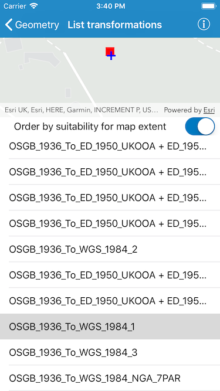

# List transformations by suitability

Transformations (sometimes known as datum or geographic transformations) are used when projecting data from one spatial reference to another, when there is a difference in the underlying datum of the spatial references. Transformations can be mathematically defined by specific equations (equation-based transformations), or may rely on external supporting files (grid-based transformations). Choosing the most appropriate transformation for a situation can ensure the best possible accuracy for this operation. Some users familiar with transformations may wish to control which transformation is used in an operation.

This sample demonstrates how to use the `AGSTransformationCatalog` to get a list of available `AGSDatumTransformation` that can be used to project an `AGSGeometry` between two different `AGSSpatialReference`, and how to use one of the transformations to perform the `AGSGeometryEngine.project` operation. The `AGSTransformationCatalog` is also used to set the location of files upon which grid-based transformations depend, and to find the default transformation used for the two `AGSSpatialReference`.



## How to use the sample
Optionally, begin by [adding projection engine data](#Offline data) to your device before running this sample. When you provision projection engine data to your device, more transformations are available for use.

Tap on a listed transformation to reproject the point geometry (shown in blue) using the selected transformation. The reprojected geometry will be shown in red. If there are grid-based transformations for which projection engine files are not available on your device, these will be highlighted in the list. The default transformation is shown in bold in the list.

## How it works
The sample sets the location of projection engine data on the device in the `MainActivity.setPeData()` method by calling `TransformationCatalog.setProjectionEngineDirectory`. If the directory is not accessible, an exception is thrown.

```java
    try {
      TransformationCatalog.setProjectionEngineDirectory(peDataFolder.getAbsolutePath());

      // Report to user that PEData was set successfully
      Snackbar.make(mMapView, getResources().getString(R.string.directory_set)  +
          TransformationCatalog.getProjectionEngineDirectory(), Snackbar.LENGTH_LONG).show();

    } catch (ArcGISRuntimeException agsEx) {
      // If there was an error in setting the projection engine directory, the location may not exist, or if
      // permissions have not been correctly set, the location cannot be accessed. Report the error message
      // to the user.
      Snackbar.make(mMapView, String.format("%s:\n%s",
          getResources().getString(R.string.directory_not_set), agsEx.getMessage()), Snackbar.LENGTH_LONG).show();
    }
```

The list of `DatumTransformations` is created in the activity's `setupTransformsList` method by calling `TransformationsCatalog.getTransformationsBySuitability`, passing in the `SpatialReference` of the original `Geometry` (the input spatial reference) and that of the `MapView` (the output spatial reference). Depending on the state of a check box, the current visible extent of the map is used to sort the list by suitability. The default transformation is also found by calling `getTransformation` and passing in the same two `SpatialReferences`. The list is shown to the user via a custom `ArrayAdapter`.

```java
    SpatialReference inputSr = mOriginalGeometry.getSpatialReference();
    SpatialReference outputSr = mArcGISMap.getSpatialReference();

    List<DatumTransformation> transformationsBySuitability;
    if (mUseExtentForSuitability) {
      transformationsBySuitability = TransformationCatalog.getTransformationsBySuitability(
          fromSr, toSr, mMapView.getVisibleArea().getExtent());

    } else {
      transformationsBySuitability = TransformationCatalog.getTransformationsBySuitability(inputSr, outputSr);
    }

    DatumTransformation defaultTransform = TransformationCatalog.getTransformation(inputSr, outputSr);
```

When the user taps on a transformation in the list, the `OnItemClickListener` responds by using the selected transformation to reproject a `Point` and then adds the point as a `Graphic`. If the selected transformation is not usable (has missing grid files) then an exception is thrown.

```java
    // Get the datum transformation selected by the user
    DatumTransformation selectedTransform = (DatumTransformation)adapterView.getAdapter().getItem(i);

    Point projectedGeometry = null;
    try {
      // Use the selected transformation to reproject the Geometry
      projectedGeometry = (Point) GeometryEngine.project(mOriginalGeometry, mMapView.getSpatialReference(),
          selectedTransform);

      } catch (ArcGISRuntimeException agsEx) {
        // Catch errors thrown from project method. If a transformation is missing grid files, then it cannot be
        // successfully used to project a geometry, and will throw an exception.
        Snackbar.make(tableList, agsEx.getMessage() + "\n" +
            getResources().getString(R.string.transform_missing_files), Snackbar.LENGTH_LONG).show();
        removeProjectedGeometryGraphic();
        return;
    }
```

## Relevant API
* TransformationCatalog
* DatumTransformation
* GeographicTransformation
* GeographicTransformationStep
* GeometryEngine.project

## Offline data
This sample can be used with or without provisioning projection engine data to your device.

To download projection engine data to your device:
1. Log in to the ArcGIS for Developers site using your Developer account.
2. In the Dashboard page, click 'Download APIs and SDKs'.
3. Click the download button next to 'ArcGIS_Runtime_Coordinate_System_Data' to download projection engine data to your computer.
4. Unzip the downloaded data on your computer.
3. Create an `ArcGIS/samples/PEData` directory on your device and copy the files to this directory.

You can use the [Android Debug Bridge (adb)](https://developer.android.com/guide/developing/tools/adb.html) tool found in **<sdk-dir>/platform-tools** to copy files to your device:
1. Open a command prompt on your computer.
2. Execute the `adb push` command to create the `ArcGIS/samples/PEData` directory and copy the files from your computer to the device:
	* `adb push <path to PEData directory on your computer> /sdcard/ArcGIS/samples/PEData`

You should now have the following directory containing projection engine data files on your target device:
  * `/sdcard/ArcGIS/samples/PEData`
  
#### Tags
Edit and Manage Data